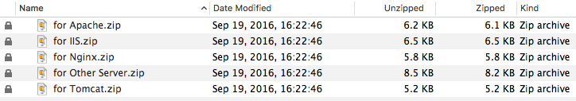

传统的**http**请求方式发送的大多是明文数据，使用简单的抓包工具就能嗅探出数据包中的授权信息。而使用**https**的方式可以有效的杜绝大部分抓包工具（非绝对，如`sslstrip`）。目前主流搜索引擎在爬取站点信息时，优先考虑**https**的网站，所以升级势在必行。

# 1. 证书申请

申请ssl证书的提供商有很多，这里以 [沃通](https://buy.wosign.com/) 为例，免费的3年使用权。当然免费的证书在安全性方面还是有待欠缺的。

**备注**：若不需要认证的媒介颁发证书，也可以在**Linux**环境中使用 `openssl` 自己生成证书。使用自定义的证书时，由于属于非官方机构颁发，浏览器会提示警告信息，只有用户授权后才能正常浏览站点。

在沃通官网 [https://buy.wosign.com/](https://buy.wosign.com/) 上注册用户、添加域名、审核域名归属权、提交域名请求文件、等待签发等一系列操作后，最后下载签发的证书，解压密码就是域名证书的密码。压缩包中含有各种平台所需的证书文件，根据自己的站点决定使用哪个。



# 2. 在Web服务上安装证书

这里使用 **apache** 服务器为例子，编辑 `httpd-ssl.conf` 文件，内容如下：

```
Listen 443
 
<VirtualHost _default_:443>
ServerAdmin wangjunneil@gmail.com
DocumentRoot "/var/www/www.wangjunneil.com"
ServerName www.wangjunneil.com
ServerAlias wangjunneil.com
<IfModule expires_module>
    ExpiresActive on
    ExpiresByType text/css A864000
    ExpiresByType application/x-javascript A864000
    ExpiresByType application/javascript A864000
    ExpiresByType text/html A864000
    ExpiresByType image/jpeg A864000
    ExpiresByType image/gif A864000
    ExpiresByType image/png A864000
    ExpiresByType image/x-icon A864000
</IfModule>
ErrorLog "/opt/lampp/logs/error_log"
TransferLog "/opt/lampp/logs/access_log"
 
# ssl证书配置
SSLEngine on
SSLprotocol ALL -sslv2 -sslv3
SSLCertificateFile "/var/www/www.wangjunneil.com/ssl/2_www.wangjunneil.com.crt"
SSLCertificateKeyFile "/var/www/www.wangjunneil.com/ssl/3_www.wangjunneil.com.key"
SSLCertificateChainFile "/var/www/www.wangjunneil.com/ssl/1_root_bundle.crt"
</VirtualHost>
```

另外编辑 `httpd-vhosts.conf` 将原有http请求强制转向到https的方式，配置如下：

```
<VirtualHost *:80>
    ServerName www.wangjunneil.com
    ServerAlias wangjunneil.com
    RedirectMatch permanent ^/(.*) https://www.wangjunneil.com
</VirtualHost>
```

# 3. 验证站点的Https访问

在浏览器中输入输入https方式的域名，检查域名前是否有绿色的SSL锁标志。有时锁图标上会有警告或者错误，这是因为当前访问的页面内容中仍有http方式的资源访问，可以通过浏览器的**debug**模式找出并统一修改成https方式即可。

当然也可以使用在线的SSL站点验证，如 [Qualys SSL Labs](https://www.ssllabs.com/ssltest/)
